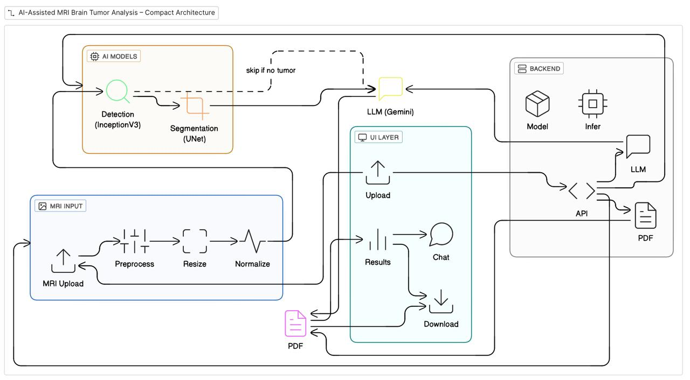

 ScanDX AI – MRI Brain Tumor Analysis System

ScanDX AI is an AI-based MRI brain tumor analysis project that I built to understand how machine learning, medical imaging, and cloud deployment work together in a real-world system.

The application allows a user to upload an MRI image, automatically detect and segment a brain tumor, generate a professional medical-style PDF report, and ask questions using an AI assistant.

⚠️ This project is for academic and learning purposes only. It is not a medical diagnostic tool.

What this project does
	•	Upload an MRI brain image
	•	Detect whether a tumor is present
	•	Identify the type of tumor
	•	Segment the tumor region
	•	Calculate tumor coverage percentage
	•	Generate a radiology-style report
	•	Export a hospital-style PDF
	•	Ask questions using an AI assistant
	•	Run fully on AWS Cloud

Technologies Used

Frontend
	•	Streamlit – for building the web UI

Machine Learning
	•	CNN (InceptionV3) – tumor classification
	•	U-Net – tumor segmentation
	•	TensorFlow / Keras
	•	NumPy, OpenCV

AI (LLM)
	•	Google Gemini
	•	Used only for report text and assistant
	•	Quota-safe fallback included

PDF Generation
	•	ReportLab
	•	Apollo-style medical report layout
	•	QR code included

Cloud & DevOps
	•	Docker
	•	Amazon ECR
	•	Amazon ECS (Fargate)
	•	Application Load Balancer
	•	AWS IAM

Project Structure

MRI_Brain/
│
├── app.py                     # Main Streamlit application
├── models/
│   ├── best_inceptionv3_tumor.h5
│   └── tumor_segmentation_unet.h5
│
├── assets/
│   └── logo.png
│
├── pdf_outputs/               # Generated reports
│
├── Dockerfile
├── requirements.txt
└── README.md

How the system works (Simple Flow)
	1.	User uploads an MRI image
	2.	Image is preprocessed (resize + normalize)
	3.	CNN model predicts tumor type
	4.	U-Net model segments tumor area
	5.	Tumor coverage is calculated
	6.	AI generates a medical report
	7.	PDF report is created
	8.	User can ask questions using AI assistant

 Architecture Overview

  

 Report Design Logic
	•	Patient details are shown only in the header
	•	Findings section contains ONLY imaging observations
	•	No patient name, age, or gender inside findings
	•	This follows proper radiology report practice

Example:

Findings:
• Well-defined mass lesion observed
• Hyperintense signal in affected region
• Mild mass effect noted

AWS Deployment Summary
	•	Docker image built for linux/amd64
	•	Image pushed to Amazon ECR
	•	Service deployed on ECS Fargate
	•	Application exposed using Application Load Balancer
	•	Updates done using Force new deployment

Important Docker Note (Mac Users)

Since I use Mac (ARM architecture), the Docker image is built using:

docker buildx build --platform linux/amd64 .

This avoids ECS errors like:

CannotPullContainerError: no matching platform

Limitations
	•	Not approved for clinical use
	•	Accuracy depends on training data
	•	No DICOM support (only image files)
	•	Gemini API has quota limits
	•	No user authentication

 Future Improvements
	•	DICOM file support
	•	Multi-sequence MRI analysis
	•	User login and history
	•	Radiologist feedback system
	•	CI/CD with GitHub Actions
	•	Auto-scaling on AWS

 Purpose of This Project
	•	Learn medical image processing
	•	Apply deep learning models
	•	Integrate LLMs with ML systems
	•	Deploy a full-stack ML application on AWS
	•	Showcase AI + Cloud skills

⸻

👤Author

Prajwal
Engineering Student
Interested in AI, ML, Cloud & DevOps

⸻

Disclaimer

This system is created only for educational and demonstration purposes.
Always consult a qualified medical professional for real diagnosis.

